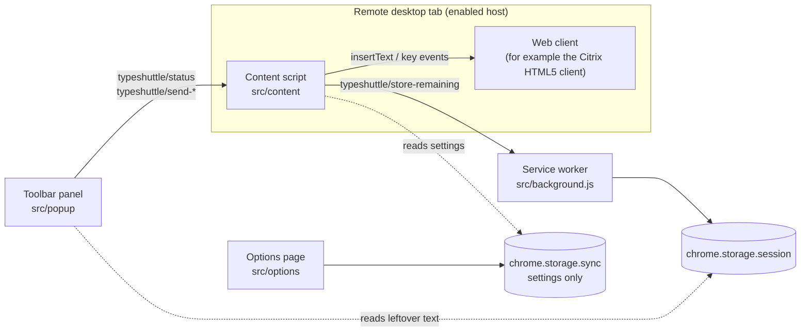

# Architecture

TypeShuttle is a Manifest V3 extension for Chrome and Edge. It takes text from the local clipboard, the toolbar panel, or a file and types it into a browser-based remote desktop client. Transfer is one way only: from the local machine to the remote session.

It has no runtime dependencies. esbuild is the only build dependency.

- [Components](#components)
- [Data flow](#data-flow)
- [Triggers](#triggers)
- [Text pipeline](#text-pipeline)
- [Precise transfer](#precise-transfer)
- [Safety](#safety)
- [Permissions](#permissions)
- [Build variants](#build-variants)
- [Design decisions](#design-decisions)

## Components



| Path | Runs in | Responsibility |
|---|---|---|
| `src/core/` | Anywhere (no `chrome.*`, no DOM) | Pure logic with unit tests: text normalization (`normalize.js`), typing plans (`segment.js`), pre-send checks (`policy.js`), the step runner (`sender.js`), precise transfer (`precise.js`), settings (`settings.js`), hotkey matching (`hotkey.js`), message validation (`messages.js`), site patterns (`sites.js`), display formatting (`format.js`) |
| `src/content/` | Content script on enabled hosts (isolated world, top frame only) | `index.js` wires everything together. `controller.js` runs the send flow. `citrix-adapter.js` talks to the client. `hotkey.js` intercepts the hotkey, `keys.js` tracks held keys, `guard.js` detects interruptions. `overlay.js` and `overlay-style.js` render the in-page UI |
| `src/background.js` | Service worker | Keeps content script registrations in line with granted hosts and stores leftover text after an abort |
| `src/popup/` | Toolbar panel | Shows the tab state, enables the current site, and hosts the send form (`send-form.js`) |
| `src/options/` | Options page | Settings form and the list of enabled sites |
| `src/shared/` | Service worker, panel, options | Wrappers around `chrome.scripting` and `chrome.permissions` (`site-registry.js`) and the leftover-text storage key (`remaining.js`) |
| `src/ui/tokens.css` | Panel, options | Design tokens for the extension pages |
| `scripts/` | Node.js | `build.mjs` builds the extension, `package.mjs` makes the release zip, `translations.mjs` checks translation sync, `icons.mjs` renders the PNG icons from the SVG logo |
| `test/unit/`, `test/e2e/` | Node.js, Playwright | See [testing.md](testing.md) |

The UI strings are currently Traditional Chinese only. This document quotes them with an English gloss.

## Data flow

### Sending with the hotkey

1. The user presses <kbd>Ctrl</kbd>+<kbd>Shift</kbd>+<kbd>V</kbd> on an enabled page. The content script intercepts the key and the browser fires a `paste` event carrying the clipboard text (see [Triggers](#triggers)).
2. `controller.js` normalizes the text, evaluates it, and builds a typing plan (see [Text pipeline](#text-pipeline)).
3. For multi-line text, text over the confirmation threshold, or text over the limit, an in-page dialog asks the user to send, cancel, or switch to precise transfer.
4. The controller checks that the client's input element exists and waits until every physical key is released.
5. `sender.js` runs the plan through the adapter while `guard.js` watches for interruptions. A progress panel shows the percentage.
6. The result appears as a toast. After an abort, the unsent text goes to the service worker so the panel can offer it later.

### Sending from the toolbar panel

1. `popup.js` resolves the active tab and derives the host pattern.
   - If the host is not granted yet, it offers 「在此網站啟用」 (Enable on this site).
   - Otherwise it asks the page for `typeshuttle/status` and injects the content script if nothing answers.
2. The send form has two modes, 「直接打字」 (Direct typing) and 「精確傳輸」 (Precise transfer). It shows line and character counts, an estimated duration, and for precise transfer the target path and sha256.
3. On send, the panel messages the content script, activates the tab and closes. The panel already showed the details, so the page skips the confirmation dialog.
4. The content script waits up to 5 seconds for the tab to be visible and focused, then follows steps 4–6 above.

### Messages

| Type | From → to | Payload | Response |
|---|---|---|---|
| `typeshuttle/status` | panel → content script | — | `{ ready, busy }` |
| `typeshuttle/send-direct` | panel → content script | `text`, `sendTabKey`, `newlineKey` | `{ accepted: true }` or `{ accepted: false, reason: 'busy' \| 'not-ready' }` |
| `typeshuttle/send-precise` | panel → content script | `dataBase64`, `createdAt`, `fileName` (or `null`) | Same as above |
| `typeshuttle/store-remaining` | content script → service worker | `text` | `{ ok }` |

Receivers ignore messages from other extensions (`sender.id` check).

- **Content script:** `validateMessage` drops anything malformed. It caps text at 5,000,000 characters and base64 at 30,000,000 characters.
- **Service worker:** it rejects leftover text over 5,000,000 characters and messages that did not come from a tab.

## Triggers

**Hotkey.** <kbd>Ctrl</kbd>+<kbd>Shift</kbd>+<kbd>V</kbd>, or <kbd>Cmd</kbd>+<kbd>Shift</kbd>+<kbd>V</kbd> on macOS.

- **Matching:** `event.code === 'KeyV'` with Shift and the platform's primary modifier, without Alt. The other primary modifier must not be held either. Physical key codes keep the hotkey working with an active IME or a non-US layout.
- **Interception:** a capture-phase `keydown` listener on `window` calls `stopImmediatePropagation()`, so the client never sees the shortcut. It does not call `preventDefault()`, so the browser still performs its paste. The matching `keyup` is swallowed too.
- **Paste acceptance:** the capture-phase `paste` listener accepts only trusted events that arrive within 1,500 ms of the hotkey. It reads `clipboardData.getData('text/plain')` and stops the event. If no paste arrives in time, a toast asks the user to click the remote screen and try again. This happens, for example, when focus is not in an editable element.
- **When it is inactive:** the hotkey is intercepted only while the extension context is alive and the adapter finds its input element. Otherwise the shortcut reaches the page unchanged.
- **Repeats:** auto-repeated keydowns are ignored.

**Toolbar panel.** For editing text before sending, choosing per-send options, or sending files.

There is no context-menu or `chrome.commands` trigger.

## Text pipeline

Direct typing applies these rules in order (`normalizeForTyping`):

| Step | Rule | Setting |
|---|---|---|
| Line endings | `\r\n` and `\r` become `\n` | — |
| Invisible characters | Removes U+FEFF (BOM), U+200B (zero-width space), U+2060 (word joiner), and C0, DEL and C1 control characters except tab and line feed. Keeps U+200C and U+200D, which emoji sequences and some scripts need | — |
| Non-breaking spaces | U+00A0, U+2007 and U+202F become a regular space | — |
| Tabs | Each tab becomes `tabWidth` spaces, unless the panel's 「這次送出 Tab 鍵」 (Send the Tab key this time) option is on | `tabWidth`, default 4 |
| Trailing newlines | Removed, so a copied command does not execute on its own | `keepTrailingNewline`, default off |

`policy.js` then counts lines and grapheme clusters (line feeds excluded) and decides three things:

- **Confirmation (hotkey only):** needed when the text has more than one line or more than `confirmCharThreshold` characters (default 500).
- **Suggest precise transfer:** above `suggestPreciseChars` (default 2,000).
- **Refuse direct typing:** above `maxDirectChars` (default 50,000).

`segment.js` builds the plan:

- Text is split on `\n`, with a `newline` step between lines.
- Each line is cut into `text` chunks of at most `chunkSize` grapheme clusters, so emoji and combining sequences are never split.
- When Tab keys are enabled, each line is also split on tabs with `tab` steps in between.

`sender.js` executes one step at a time and then waits: `lineDelayMs` after a newline, `chunkDelayMs` after anything else. The duration estimate shown to users is the sum of these delays.

| Speed | `chunkSize` | `chunkDelayMs` | `lineDelayMs` |
|---|---|---|---|
| 快 (fast) | 200 | 20 | 40 |
| 標準 (normal, default) | 100 | 40 | 80 |
| 保守 (safe) | 40 | 80 | 150 |

The runner checks the abort signal before every step. It stops with status `error` if the adapter throws. Otherwise it returns `done` or `aborted`, the current line number, and the unsent remainder rebuilt from the remaining steps. The remainder is the normalized text, so tabs are already expanded.

### Adapter contract

The controller and runner only talk to an adapter:

| Method | Meaning |
|---|---|
| `isAvailable()` | The client's input element is present on the page |
| `insertText(text)` | Insert one chunk of text with no line breaks |
| `pressNewline({ shift })` | Press Enter, or Shift+Enter |
| `pressTab()` | Press Tab |

`src/content/citrix-adapter.js` is currently the only adapter, and `index.js` creates it directly. It implements the contract as follows (behavior IDs refer to [clients.md](clients.md#citrix-workspace-app-for-html5)):

- It looks up `#CitrixClientImeBuffer` on every call, so a rebuilt element is still found (F1).
- **`insertText`:** focuses that element and dispatches an empty `InputEvent('input', { data: '', inputType: 'insertText' })` (F5). It then calls `document.execCommand('insertText', false, text)` (F2, F4) and throws a user-facing error if the browser refuses.
- **`pressNewline` and `pressTab`:** dispatch untrusted `KeyboardEvent`s (F6–F8). Enter sends `keydown`, `keypress` and `keyup`; Tab sends `keydown` and `keyup`; Shift+Enter wraps them in Shift `keydown`/`keyup`. `keyCode`, `charCode` and `which` are passed to the constructor (F9).

## Precise transfer

Precise transfer makes the remote shell rebuild the exact bytes and print their hash. The input is one of:

- the raw text (UTF-8, none of the text pipeline rules applied);
- a file picked in the panel.

Both are limited by `maxPreciseBytes` (default 1 MiB, adjustable up to 20 MiB).

1. `precise.js` compresses the bytes with `CompressionStream('gzip')`, encodes them as base64 and wraps them at 76 characters per line.
2. It computes the sha256 of the original bytes with `crypto.subtle`.
3. It builds the file name:
   - The base is a local timestamp `YYYY-MM-DD_HHMMSS`, taken when the panel opened or when <kbd>P</kbd> was chosen in the dialog.
   - Text gets `.txt`.
   - A file's name is appended after `_`. Characters outside `[A-Za-z0-9._-]` become `_`, runs of dots collapse to one, leading underscores are dropped, and the name is capped at 80 characters.
   - A name that is empty after sanitizing gives `.bin`. A name starting with a dot is appended without the underscore.
4. It types this command through the normal plan runner, with Enter between lines and Tab keys off:

```bash
mkdir -p ~/typeshuttle-inbox && base64 -d <<'TYPESHUTTLE_EOF' | gunzip > ~/typeshuttle-inbox/<file name>
<base64 lines>
TYPESHUTTLE_EOF
sha256sum ~/typeshuttle-inbox/<file name>
```

The command ends with a newline, so `sha256sum` runs and its output can be compared with the hash in the success toast.

Constraints:

- The cursor must be in a shell that supports heredocs and has `base64 -d`, `gunzip` and `sha256sum`, such as bash with GNU coreutils.
- The directory comes from the `preciseDir` setting (default `~/typeshuttle-inbox`). It must match `^(~/|/)?[A-Za-z0-9._-]+(/[A-Za-z0-9._-]+)*$` and contain no `..` segment. The file name must match `^[A-Za-z0-9._-]+$`. Anything else throws before any typing starts.
- The delimiter is quoted, so the shell does not expand the payload. The base64 alphabet cannot form the delimiter line.
- The file name includes seconds, and `>` overwrites a file with the same name. Two transfers within the same second can therefore overwrite each other.
- If a precise transfer is aborted, the remote terminal is still inside the heredoc. The toast tells the user to press <kbd>Ctrl</kbd>+<kbd>C</kbd> remotely, and no leftover text is stored.

## Safety

**Confirmation dialog (hotkey sends).**

- **Content:** it previews the first 8 lines, shows line and character counts and an estimated duration, and adds notices. The notices warn that each line runs immediately in a terminal, suggest precise transfer for long text, and flag text over the limit.
- **Keys:** while the dialog is open, every trusted `keydown` is captured and kept from the client. The keymap uses physical codes: `Enter` and `NumpadEnter` send, `Escape` cancels, `KeyP` switches to precise transfer. The `keyup` of the chosen key is swallowed, and auto-repeat is ignored.
- **Over the limit:** the send action is disabled.

**Held keys.** `keys.js` registers its listeners first so it sees every trusted key. Typing starts only after all physical keys are released, including modifiers and the Enter that confirmed the dialog. If keys are still held after 3 seconds, the send is cancelled with a toast.

**Focus for panel sends.** The page waits up to 5 seconds for the tab to be visible and focused. If it never is, nothing is typed. The direct text is kept for the panel.

**Interruptions while typing.** The send aborts on any of these:

- a trusted `keydown` (the key and its `keyup` are not forwarded);
- a trusted `mousedown`;
- the tab becoming hidden;
- the window losing focus.

Events dispatched by the extension are untrusted and never count.

**One send at a time.** A second hotkey during a send shows a toast. A panel send is rejected with `busy`.

**Leftover text.** After a direct send stops early, the toast shows the line where it stopped.

- **Where it goes:** the unsent text is stored in `chrome.storage.session` under `remaining:<tabId>`. That storage lives in memory only and is cleared when the browser closes.
- **How it comes back:** the panel loads it into the text box with a banner.
- **When it is removed:** when a panel send is accepted, when the user clicks 「清除」 (Clear), or when the tab closes.

**Overlay.**

- **Structure:** a `typeshuttle-overlay` element appended to `document.documentElement`, holding a shadow root that is closed in production builds.
- **Pointer events:** mouse, pointer, wheel, touch and context-menu events are stopped at the host element, so clicks on the overlay do not reach the client.
- **Toasts:** at most three are shown. Success toasts close after 6 seconds, warnings and errors after 12.

**Stale content scripts.**

- **Problem:** after the extension updates or reloads, the old content script stays in open tabs, but `chrome.runtime.id` becomes undefined.
- **Handling:** each instance registers itself on `globalThis.__typeshuttleInstance`. A new injection, for example when the panel opens, disposes the previous instance and takes over, but only if that instance is no longer alive. If the hotkey reaches an orphaned instance first, it releases its listeners and lets the key through. Either way, a paste is never typed twice.

## Permissions

| Permission | Why |
|---|---|
| `storage` | Settings in `chrome.storage.sync`, and leftover text in `chrome.storage.session` |
| `scripting` | Registers the content script for granted hosts and injects it into the current tab right after enabling, or when it does not answer |
| `activeTab` | Lets the panel read the current tab when the user opens it |
| `optional_host_permissions`: `https://*/*`, `http://*/*` | Declares what may be requested. Only one host is ever requested, as `<scheme>://<hostname>/*` |

**Enabling a site.**

- **At install:** the extension has no host access.
- **Enabling from the panel:** clicking 「在此網站啟用」 (Enable on this site) calls `chrome.permissions.request` directly in the click handler. The panel then registers a content script with the ID `typeshuttle-site-<hash>`. It uses `document_start`, the top frame only, and persists across sessions. The panel also injects the script into the open tab, so no reload is needed.
- **Match patterns:** they ignore ports, so enabling `https://host:8443/` grants `https://host/*`.
- **Other ways to grant or revoke:**
  - Granting access under "Site access" in `chrome://extensions` fires `permissions.onAdded`, which registers the script too.
  - Revoking access fires `permissions.onRemoved`, which unregisters it.
  - 「移除」 (Remove) on the options page does both.
- **Reconciling:** on install, update and browser startup, registrations are brought back in line with granted hosts.

**Not used.** `debugger`, `clipboardRead`, `tabs`, `<all_urls>`, and static `host_permissions` in production builds. The extension makes no network requests.

## Build variants

| Command | Output | Differences |
|---|---|---|
| `npm run build` | `dist/extension/` | Production build. `__TYPESHUTTLE_TEST__` is `false`, so the overlay uses a closed shadow root |
| `npm run build:test` | `dist/extension-test/` | Name `TypeShuttle (test)`. It adds `host_permissions: ["http://127.0.0.1/*"]` so e2e tests run without the permission prompt, and it uses an open shadow root so Playwright can inspect the overlay |
| `npm run package` | `release/typeshuttle-<version>.zip` | Production build zipped. The script prints the zip's sha256 |

In both builds, `scripts/build.mjs` bundles the code with esbuild for `chrome120`.

- **Formats:** `content.js` is an IIFE (content scripts must be classic scripts). `background.js`, `popup.js` and `options.js` are ES modules.
- **Static files:** HTML, CSS and icons are copied over.
- **Version:** the manifest `version` comes from `package.json`.

## Design decisions

### Type inside the browser, not at the OS level

- **Context:** OS keystroke tools (xdotool, ydotool, AutoKey) send key codes. A remote IME reinterprets them (F3), and they cannot produce CJK text.
- **Decision:** insert text into the web client's own input element, where it travels as Unicode (F2).
- **Consequence:** it works regardless of the remote IME and the local OS. It only helps with browser-based clients, and each client needs an adapter.

### `execCommand('insertText')` instead of `chrome.debugger`

- **Context:** the debugger API can dispatch trusted input, but it shows a warning banner and grants far broader power.
- **Decision:** insert from the content script with `document.execCommand('insertText')`. This works on the Citrix client (F4).
- **Consequence:** no debugger permission. The extension depends on a legacy API that Chrome still supports.

### An empty input event before each chunk

- **Context:** after any key event, the Citrix client drops the next text input (F5).
- **Decision:** dispatch an empty `insertText` input event before every chunk.
- **Consequence:** one extra event per chunk. This was confirmed harmless when nothing is being dropped.

### Newlines and Tab as synthetic key events, with legacy fields in the constructor

- **Context:**
  - Line feeds inside inserted text are removed (F6).
  - Tab characters become spaces (F8).
  - Page-created Enter key events are forwarded (F7).
  - Properties added with `Object.defineProperty` in the isolated world are invisible to the page (F9).
- **Decision:** type line by line and press Enter between lines, passing `keyCode`, `charCode` and `which` to the `KeyboardEvent` constructor. Tabs become spaces unless the user asks for real Tab keys.
- **Consequence:** a newline behaves like pressing Enter in the remote application. That is why the dialog warns about terminals, trailing newlines are trimmed by default, and precise transfer exists.

### Hotkey through the trusted paste event

- **Context:** reading the clipboard directly needs the `clipboardRead` permission or an offscreen document.
- **Decision:** intercept the <kbd>Ctrl</kbd>+<kbd>Shift</kbd>+<kbd>V</kbd> keydown without cancelling it, then read `clipboardData` from the trusted `paste` event that follows.
- **Consequence:** no clipboard permission, and the page never receives the shortcut. It needs focus in an editable element, and forged paste events are rejected.

### Per-host optional permissions with dynamic registration

- **Context:** static access to all sites triggers a broad install warning and makes enterprise review harder.
- **Decision:** declare optional host permissions, request a single host when the user clicks, and register the content script dynamically.
- **Consequence:** no host warning at install. Users enable each site once, and removing a site revokes access.

### Closed shadow root for the overlay

- **Context:** the confirmation preview shows clipboard text on a page the extension does not control. Page CSS could also break the UI, and clicks could reach the remote session.
- **Decision:**
  - Production builds use a closed shadow root.
  - Pointer events stop at the host element.
  - Keys are captured while the dialog is open.
- **Consequence:** page scripts cannot read the preview through `shadowRoot` before the user confirms, so e2e tests need a separate build with an open root. The client still receives whatever the user chooses to send.

### Precise transfer as a self-verifying shell command

- **Context:** remote editors and shells change typed text (auto-indent, bracket completion, tab completion), and long text types slowly.
- **Decision:** send gzip-compressed base64 inside a quoted bash heredoc that decodes to a file and prints its sha256.
- **Consequence:**
  - The bytes arrive exactly and can be checked against the local hash.
  - Small files can be sent too.
  - The cursor must be in a compatible shell.
  - Directory and file name are restricted to an ASCII allowlist, because they appear in a shell command.

### No network, no history

- **Context:** the extension handles clipboard contents that may be sensitive.
- **Decision:** no network requests, analytics or logging of content. Only settings are persisted.
- **Consequence:** content never leaves the browser except by being typed into the page the user chose. There is no send history.

### Leftover text in session storage only

- **Context:** after an abort, the user has to move the remote cursor back before sending the rest.
- **Decision:** keep the remainder per tab in `chrome.storage.session`, and clear it on a successful panel send, on 「清除」 (Clear), or when the tab closes.
- **Consequence:** the remainder survives the panel closing but is never written to disk and disappears when the browser closes.

### Pure core, thin browser layer

- **Context:** content scripts and extension pages are slow and brittle to test.
- **Decision:** keep every decision (normalization, plans, limits, command building, validation) in `src/core/` without `chrome.*` or DOM access. Cover the browser layer with e2e tests against an emulator page.
- **Consequence:** unit tests enforce 80% line, branch and function coverage on `src/core/`. The emulator must stay in sync with the client behaviors in [clients.md](clients.md).

### One adapter per client

- **Context:** every web client has its own input element and quirks.
- **Decision:** the controller and runner depend only on the [adapter contract](#adapter-contract), and all client-specific code lives in the adapter.
- **Consequence:** supporting another client means a new adapter, an emulator page, e2e tests and an entry in [clients.md](clients.md). Today `index.js` creates the Citrix adapter directly. See [CONTRIBUTING.md](../.github/CONTRIBUTING.md#adding-support-for-a-remote-desktop-client).
